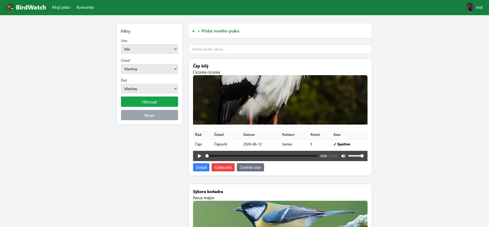
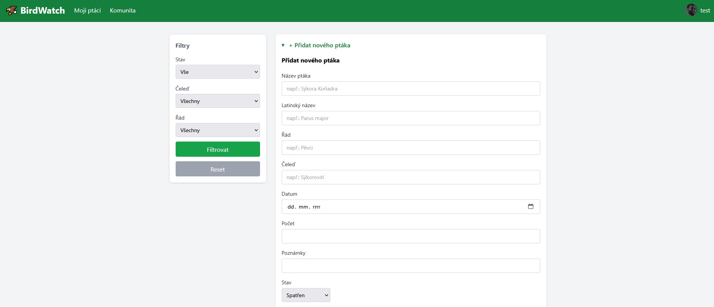
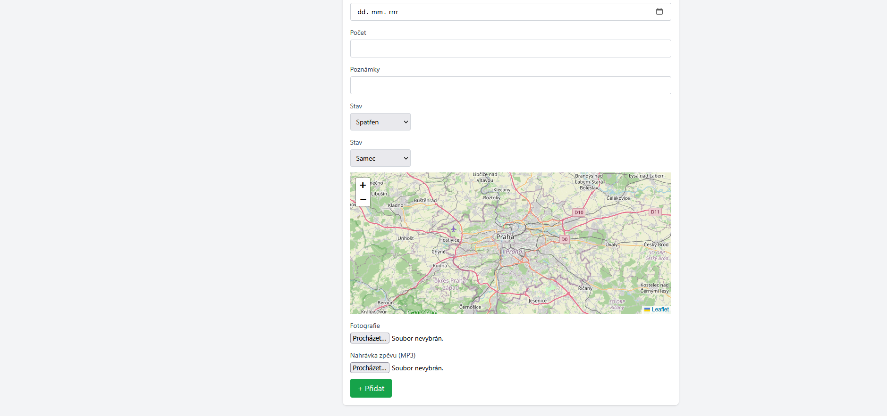
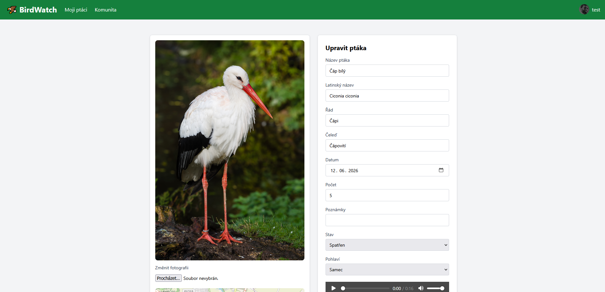
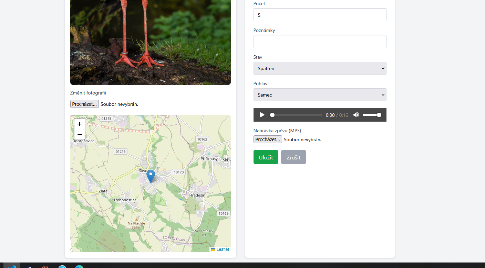
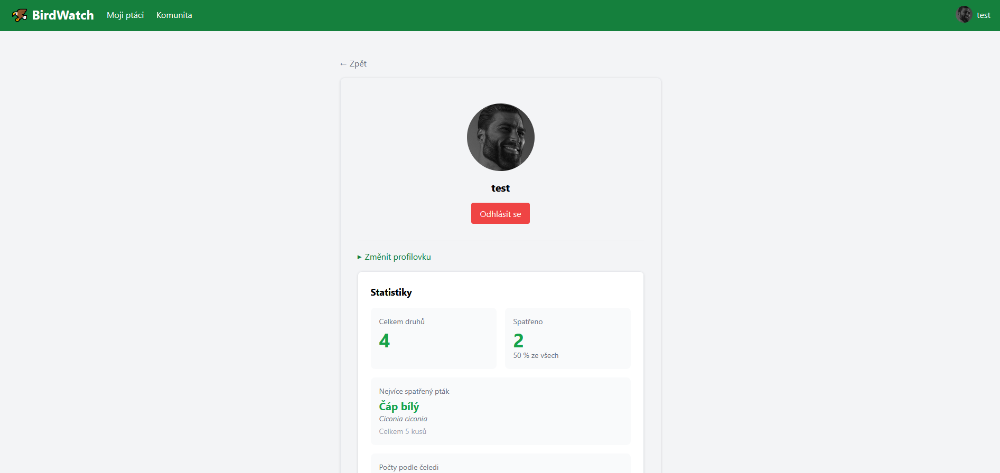
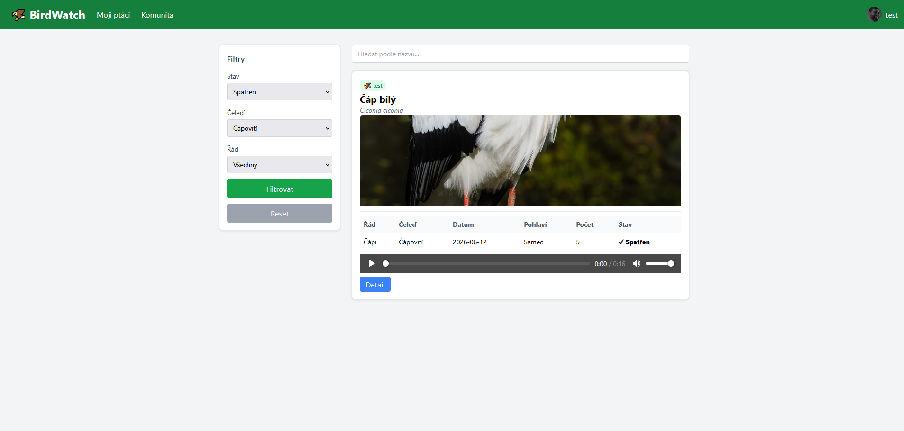
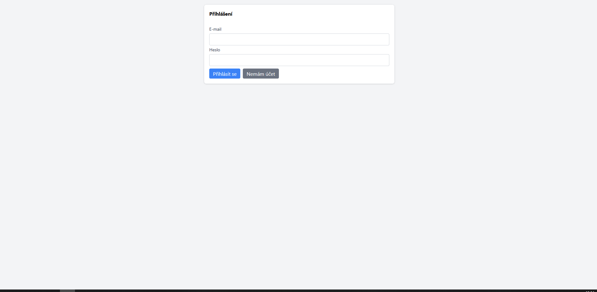
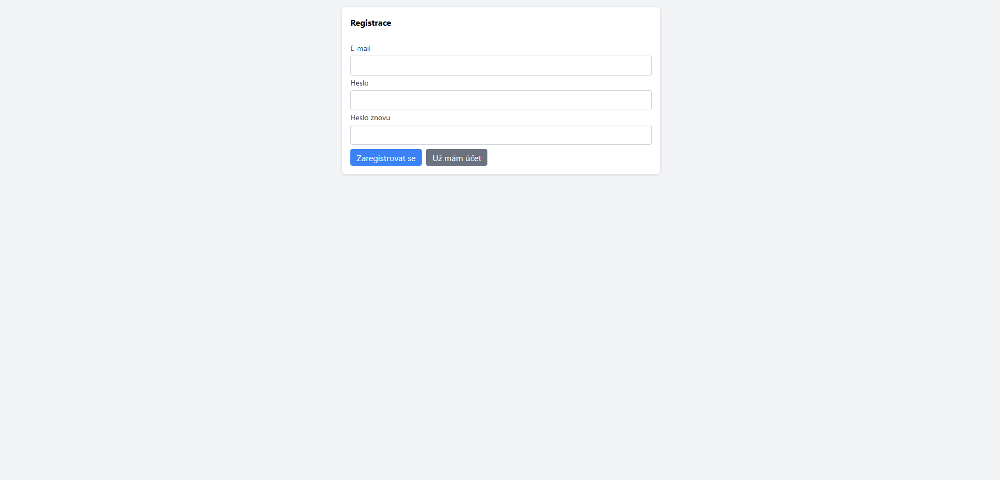

# BirdWatch 🦅

A server-side rendered field journal for birdwatchers to record, manage, and share their bird sightings.

## Description

BirdWatch is a full-stack web application that allows users to log birds they have spotted, including species name, latin name, order, family, location (via interactive map), date, count, photos, audio recordings, and personal notes. The app supports real-time updates via WebSockets — when a user adds a bird, it appears instantly for all connected users on the Community page.

## Features

- User registration and login with password hashing (salt + hash via Node.js crypto module)
- Add, edit, and delete bird sightings
- Upload photos and audio recordings (bird songs)
- Filter birds by order, family, and seen status
- Search birds by name
- Interactive map to select and display sighting location (Leaflet)
- Community page — view all users' sightings with real-time WebSocket updates
- Profile page with avatar upload and personal statistics
- Bird detail/edit page — read-only for non-owners, editable for the owner
- Server-side rendered HTML using EJS templates
- 404 and 500 error pages

## Technologies

- Node.js
- Hono (web framework)
- EJS (server-side templating)
- Drizzle ORM + SQLite (database)
- WebSockets via @hono/node-ws
- Leaflet (maps)
- Tailwind CSS via CDN (styling)
- AVA (unit tests)

## Architecture

This project uses **Server-Side Rendering (SSR)** — the server generates complete HTML pages before sending them to the browser. This is in contrast to client-side rendering (CSR) where JavaScript builds the page in the browser. SSR improves initial load time, SEO, and gives the server full control over what the user sees.

## Limitations

- No pagination — all birds load at once (suitable for small datasets)
- WebSocket URL is hardcoded to `localhost:3000`
- No email verification on registration
- No friend/follow system — the Community page shows sightings from all registered users
- Each bird supports only one photo and one audio recording — no gallery support

## Installation

```bash
git clone https://github.com/Mikulas-code/birdwatch.git
cd birdwatch
npm install
npx drizzle-kit migrate
npm run dev
```

## Running Tests

```bash
npm test
```

## Screenshots
### Homepage


### Adding new bird



### Bird detail



### Profile page


### Comunity page


### Login page


### Register page
